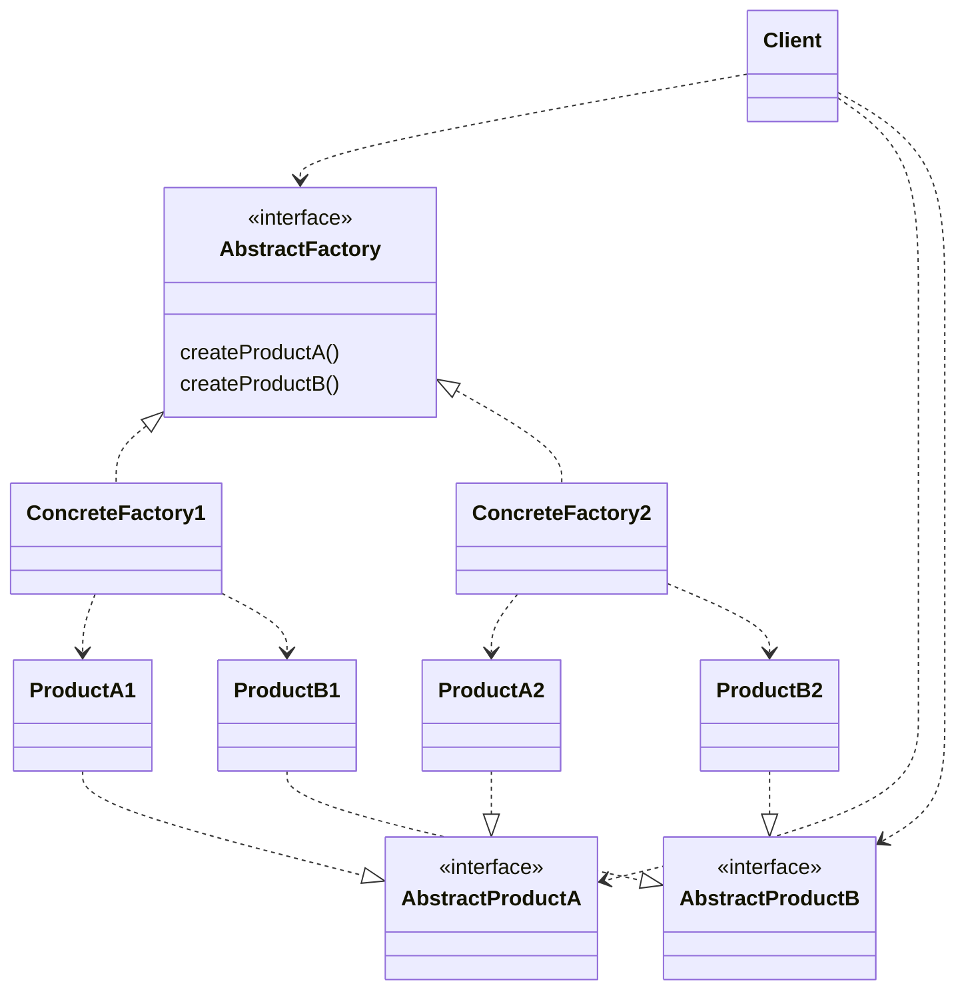
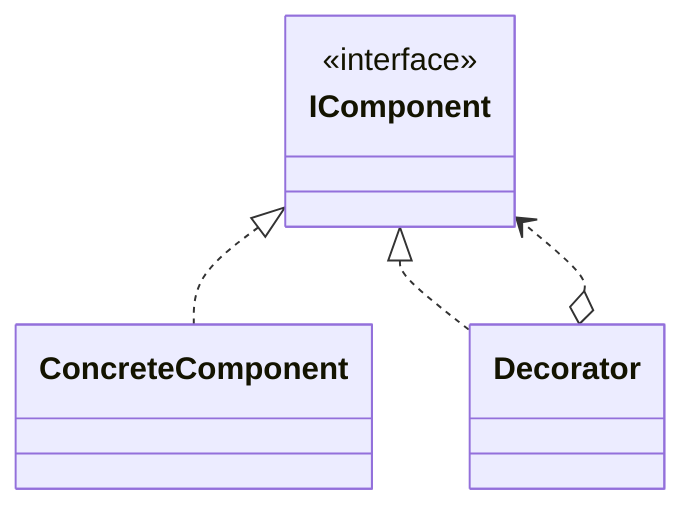
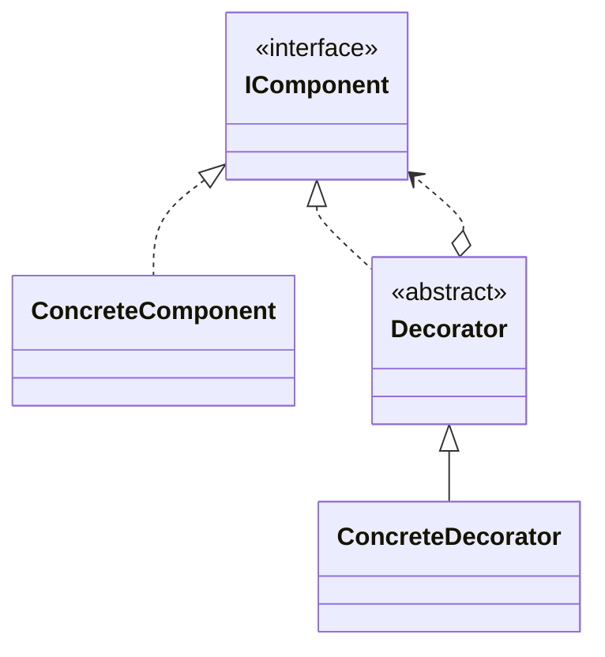
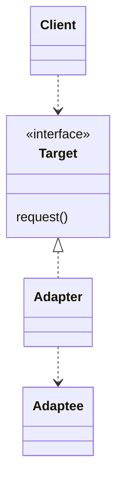
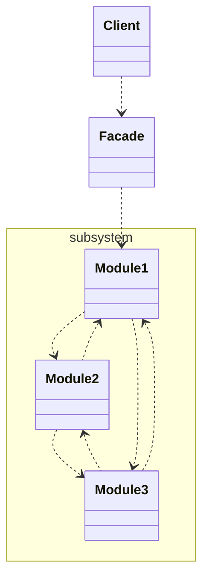
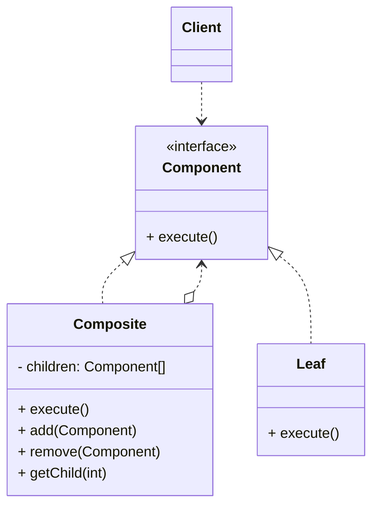
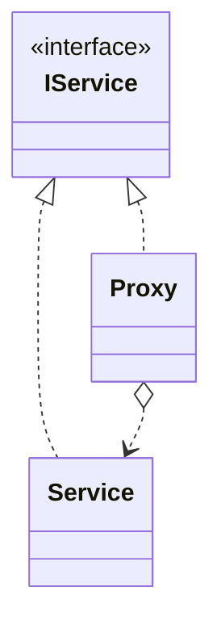
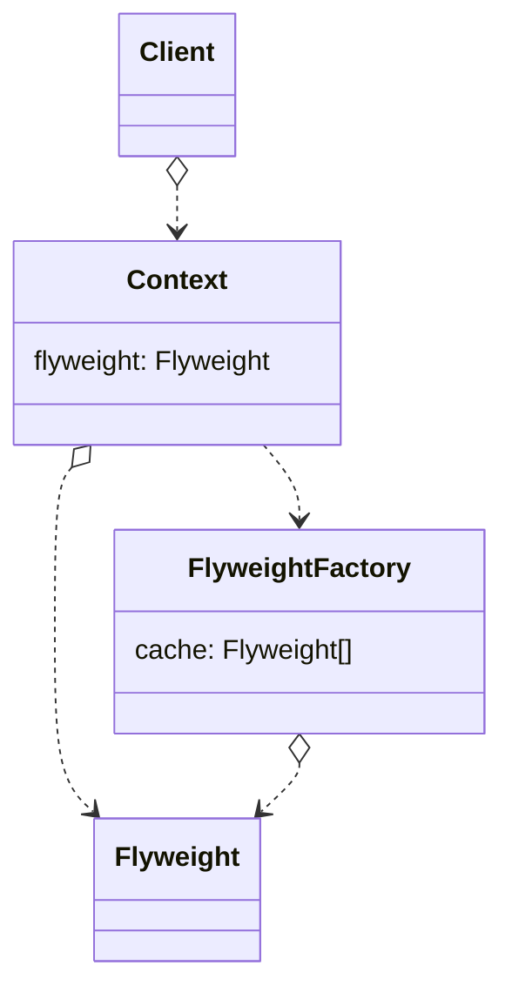

## AbstractFactory

# 構造
## Decorator

- インタフェースをより簡潔にする
- 追加の責務を動的に与える
- 機能を一つ一つ被せていくイメージ
- サブクラスの代替となる機能拡張手段
- 既存コードを変更せずに新しい振る舞いを追加できる

## Adaptor

- 目的：インターフェースを別のものに変換
- あるインターフェースをクライアントが求めるインターフェースに変換する
	- ライブラリの互換性の確保
	- 新旧システム間の連携
- クライアントがコードを全く変更せずに新しいライブラリやサブセットを使える

## Facade

- 目的：単純化
- サブシステムの一連のインターフェースに対する、統合されたインターフェースを提供する
- インターフェースを変更せずに、責務を追加する
- 既存のクラスを複数組み合わせて使う手順を、「窓口」となるクラスを作ってシンプルに利用できるようにする

## Composite

- オブジェクトをツリー構造（階層構造）に構成して部分－全体階層を表現できる
- ツリーを構成するオブジェクトの具象クラスを気にする必要がない

## Proxy

- 別のオブジェクトへのアクセスを制御する代理オブジェクトを作る
	- 別オブジェクト＝リモートオブジェクト、作成にコストがかかるオブジェクト、安全性が必要オブジェクト
- 元のオブジェクトへのアクセスを制御し、 元のオブジェクトへリクエストが行く前か後に別の何かを行うようにすることができる

## Flyweight

https://refactoring.guru/ja/design-patterns/flyweight

- １クラスから多量にオブジェクトを作るデータのうち、不変のデータを外だしして再利用
	- オブジェクト内の不変のデータは、 内因的状態 （intrinsic state） と呼ばれる
		- これはオブジェクトの中に存在し、 他のオブジェクトはこれを読むだけで、 変更することはできない
	- オブジェクトの残りの状態は、 しばしば他のオブジェクトによって 「外側から」 変更され、 外因的状態 （extrinsic state） と呼ばれる
- 外因的状態をオブジェクト内部に持つことはやめる。代わりに、 この状態は、 依存する特定のメソッドに渡す
	- 内因的状態だけをオブジェクトに保管し、 違った状況で再利用する
- メモリ使用量削減

# 振る舞い
## Iterator

# Compound

- 複数のパターンを一緒に使い組み合わせ、繰り返し起こる問題や一般的な問題を解決するための解決方法
- 