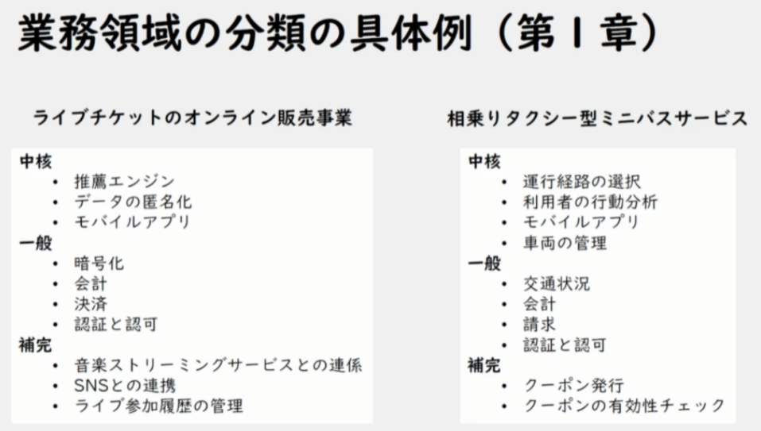
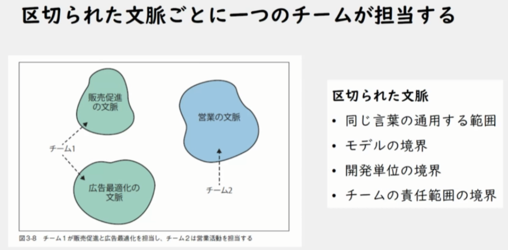

https://speakerdeck.com/masuda220/learning-domain-driven-design-japanese-edition-findy-2024-7

ドメイン駆動設計を実践するために最初に手にするべき１冊
https://www.oreilly.co.jp/books/9784814400737/

DDDにこだわらなくても、ソフトウェア設計の視点でもためになることがある

2章： 業務をより理解するには？

３章：事業の複雑さに立ち向かう

同じ言葉で文脈が違えば、意味が違う

どうやって区切っておけば、変更が無く安全にできるか ⇒ 区切られた文脈

４章：区切られた文脈同士の連係

11章：

付録A：開発チームの学習と成長　（失敗談、そこからの学び）

