https://speakerdeck.com/tockn/prisma-ormwo2nian-yun-yong-sitepei-tutanouhauwogong-you-suru

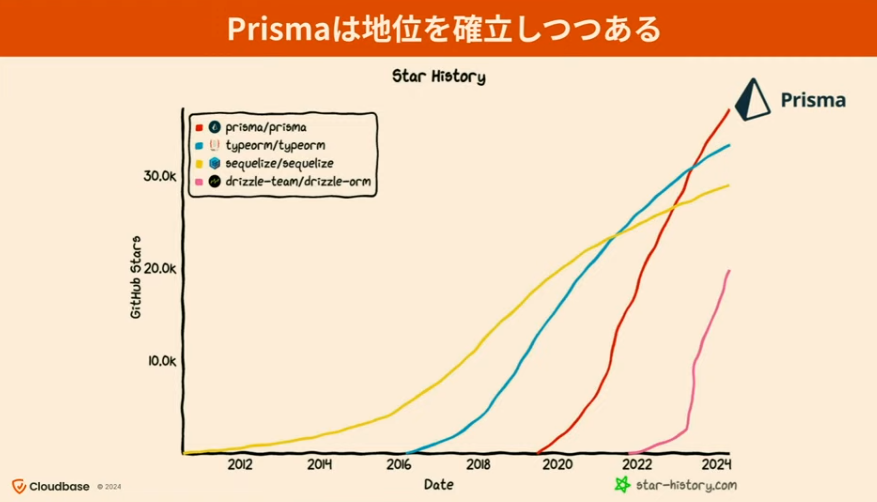

複数のSQLを生成して取得
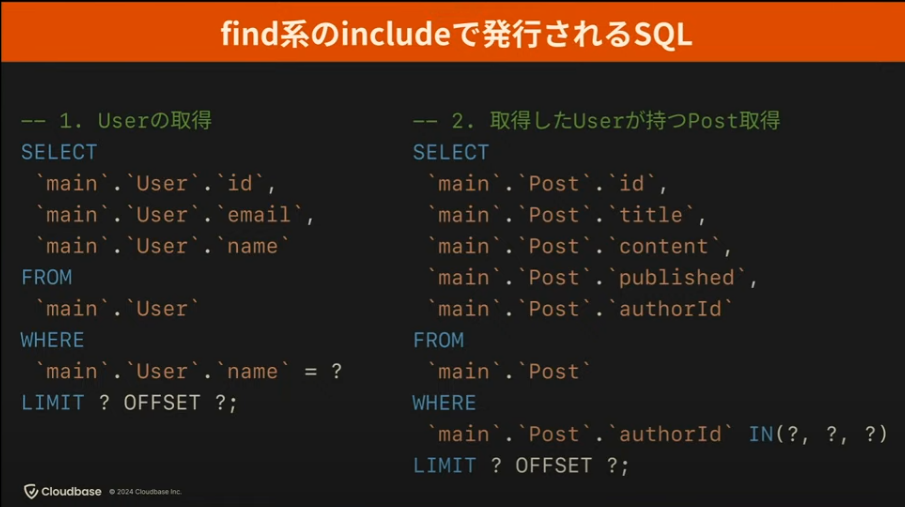

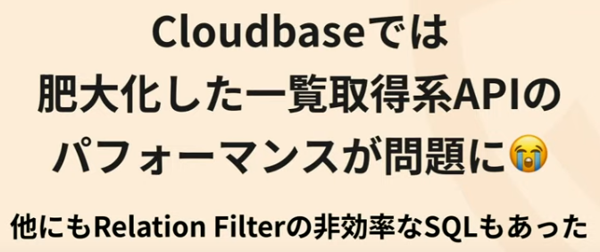

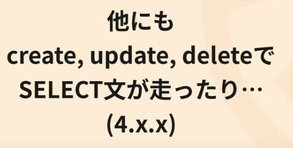

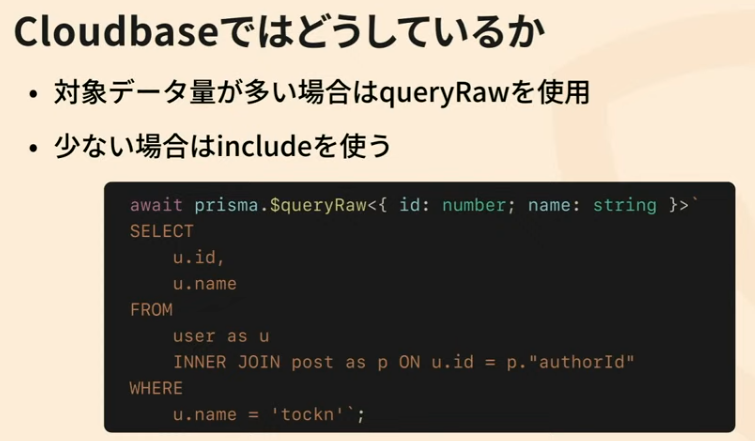

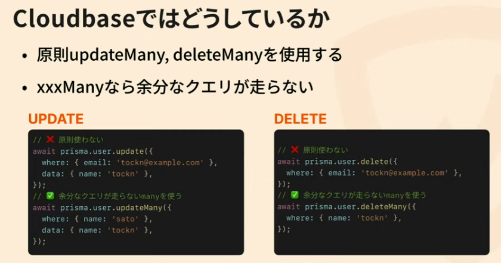

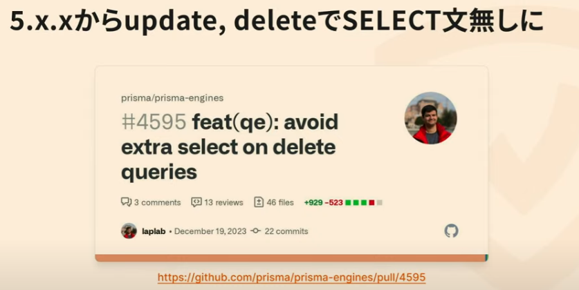

join 使える
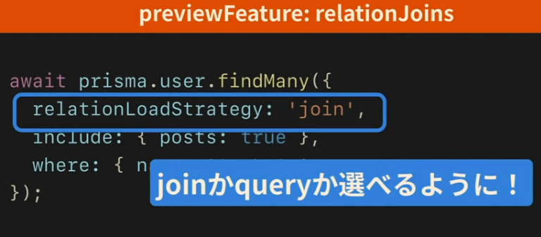

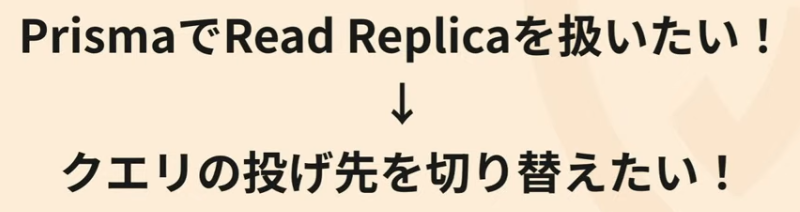

→ 独自の Prisma Client Wrapper を用意している
tx = TransactionClient
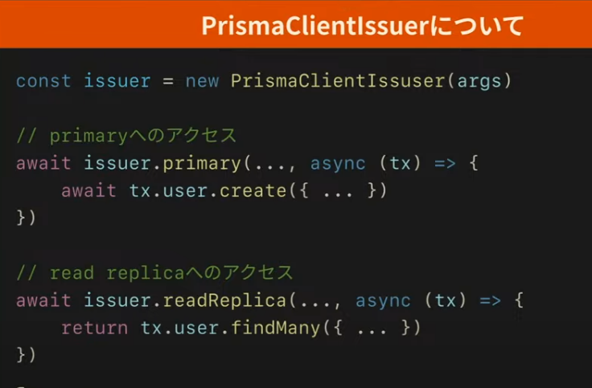

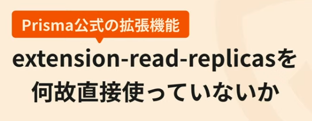

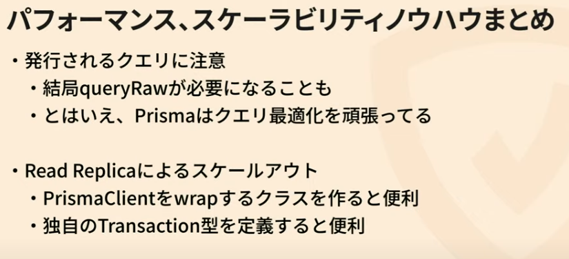

権限によるアクセス制御は

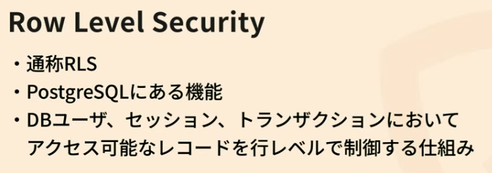

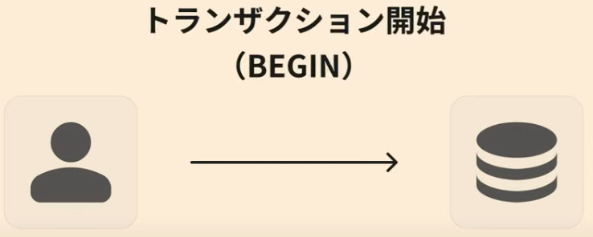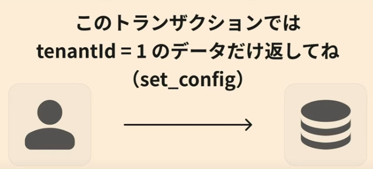
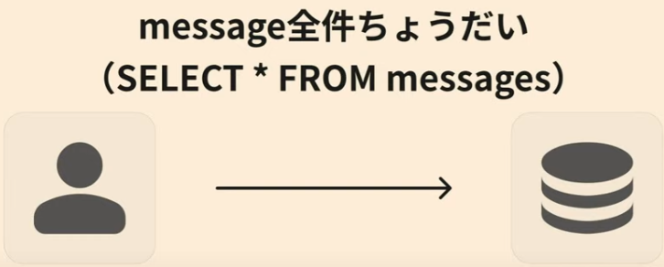
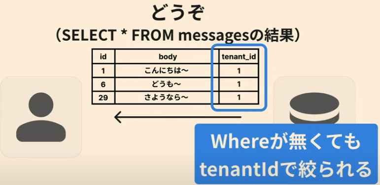

独自 Clinet に機能を入れている
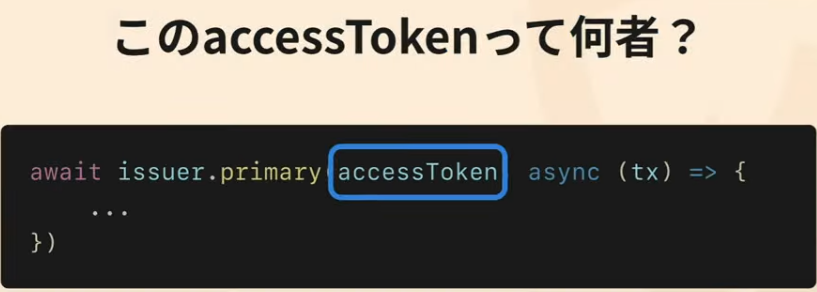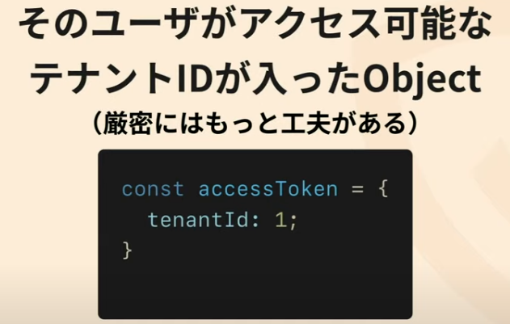
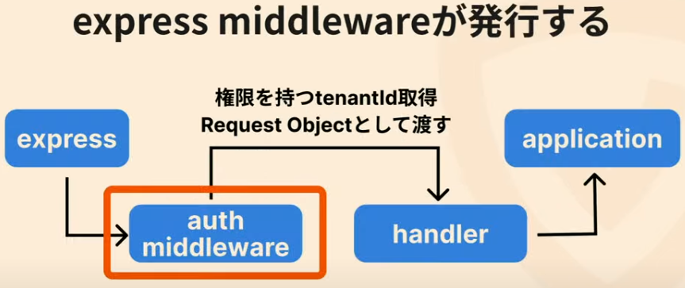

列のフィルターは zod を使って絞っている

内製テストランナーをOSS化
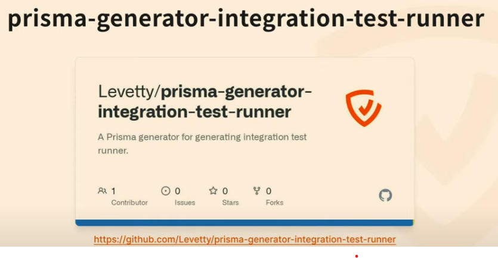

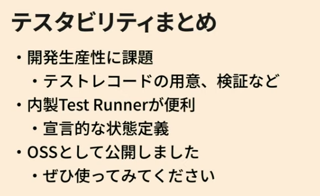

オブザーバビリティ

Prismaの裏の処理：
- DBとのコネクション確立
- PrismaClientからPrismaEngine向けクエリの変換
- SQL発行
- DBからの結果をPrismaClientの結果として変換

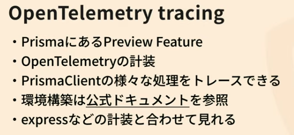

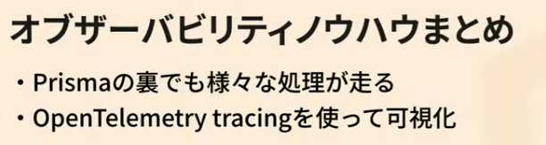

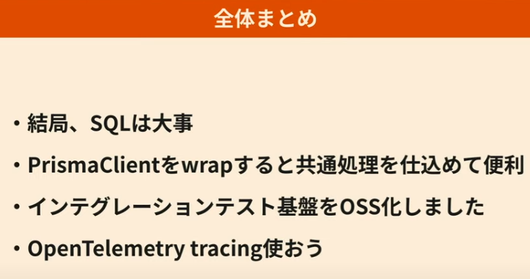

