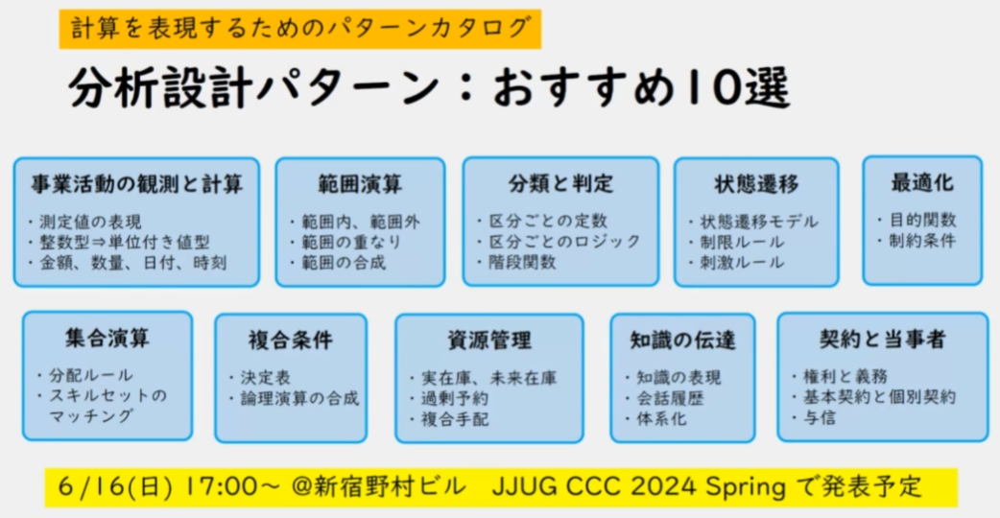

増田さん

アンチパターンに対して、なぜそうなっちゃうのか、どう立ち向かうのかの経験則

## 不適切な設計：大きな泥団子

現実問題として、小さな修正を積み重ねれば積み重ねる程、こうなってしまう

間違った達成感はまずい状態

## 銀の弾丸： 関心の分離

関心の分離＝根柢の設計原則

銀の弾丸＝存在しない
根底にある考え方を意識しながら、個別の具体的な解決策の経験を積み重ねる

設計とは：
- 経験則
- 習熟
- 共創

なぜ、関心の分離が必要なのか

→TDDの根底と同じ

## 関心の分離の枠組み：計算、アクション、アダプター

アプリケーションアーキテクチャの視点で考える時、この３つを意識する
→大きな泥団子になることを防げる

ポート＆アダプター がベースにある考え方
であり、各アーキテクチャスタイルの根底にある共通の考え方

INアダプター と OUTアダプターは、フレームワーク等がしっかりているので最近は分けられている
→ ほっといてもある程度制約があるので、構造化できるが
　計算はどこにでも書けてしまう

効果的な基本的アプローチ

業務機能を実現するスクリプト からも分離できる
※あとで見返す

要は計算：
- 境界値
- デシジョンテーブル
- 状態遷移
計算判定ロジック＝業務ルール

アクションからはOUTアダプターを見えなくする（知識を持たないようにする）

## 設計の分離の基礎となる設計技法

オブジェクト指向 は 抽象データ型の考え方がベースになっている

コンストラクタで制約を設ける
静的な構造（宣言的な記述）で品質が担保できる

計算を扱う部分ではイミュータブルで扱う＝常識

## 関心の分離：その他の実践技法

ディレクトリの 階層構造も設計になる（時間をかけるだけの価値がある）
→ 重要

実験のコストが下がったので、やってみて観察した方が早い

コードの雑音を気にしない開発チームに明るい未来はやってこない
→チームとして

