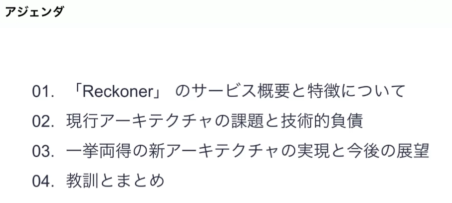

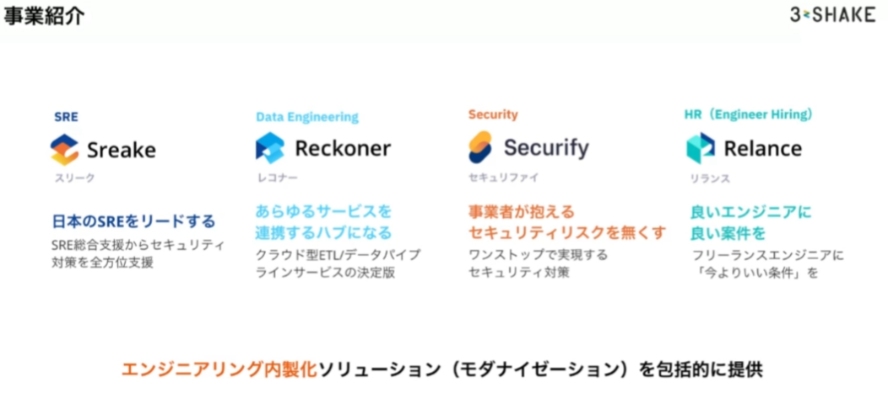

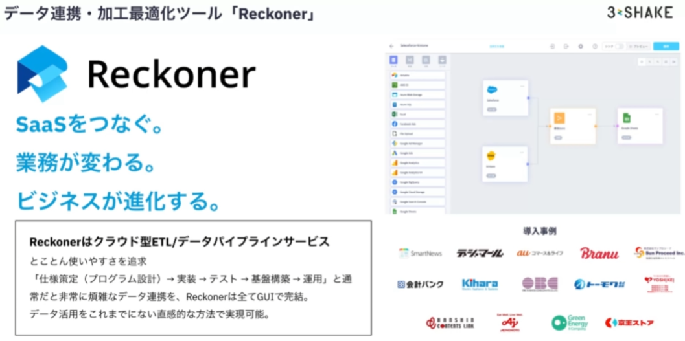

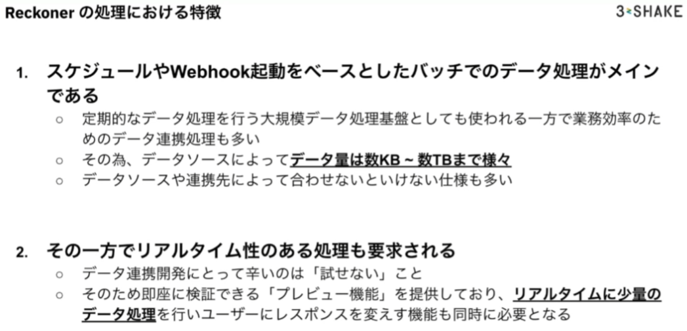

## 現アーキテクチャと技術的負債

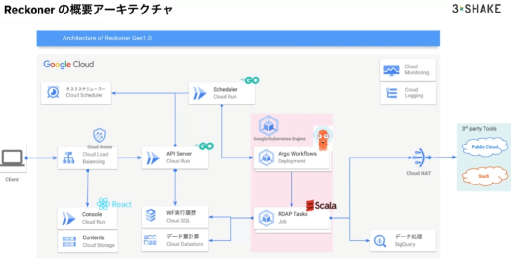

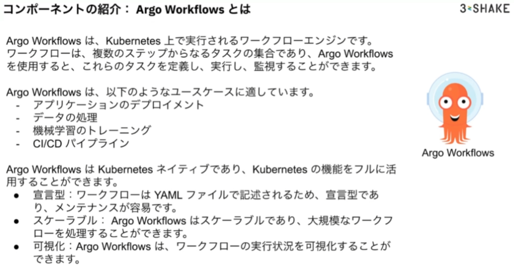
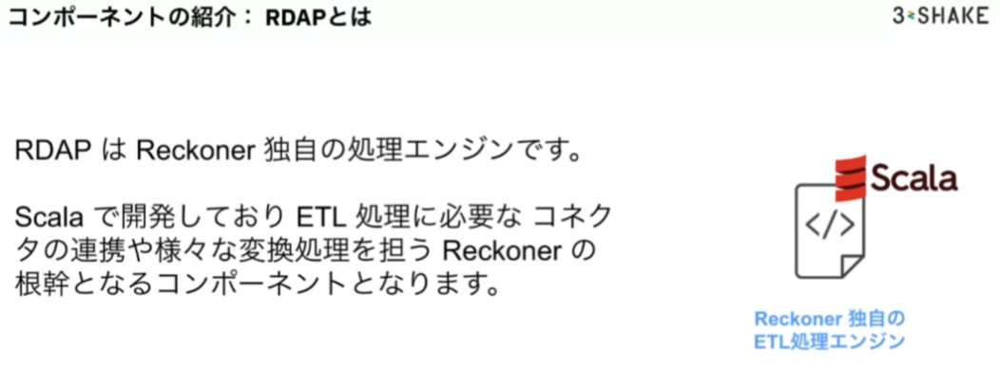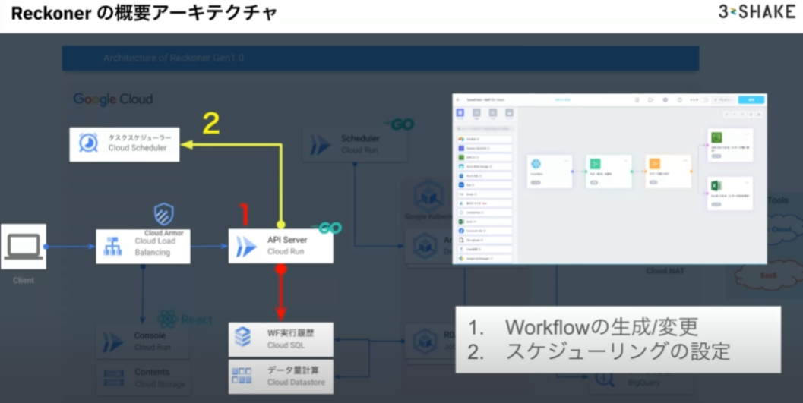

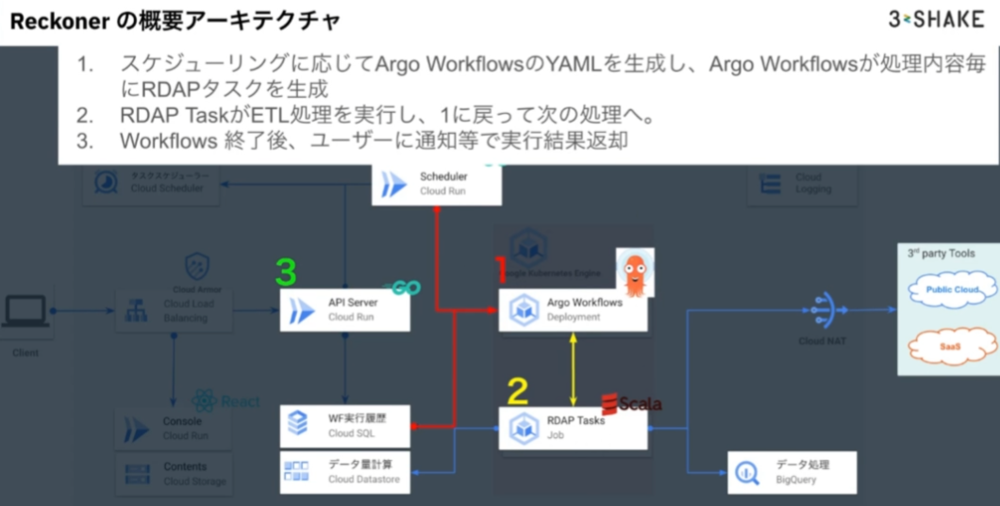

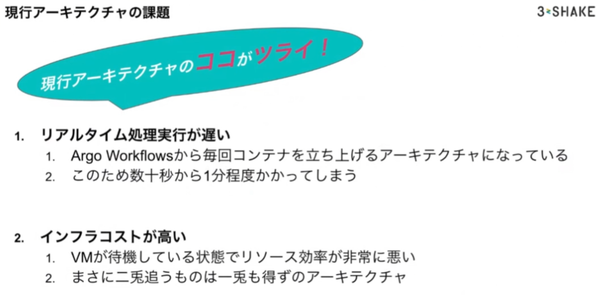
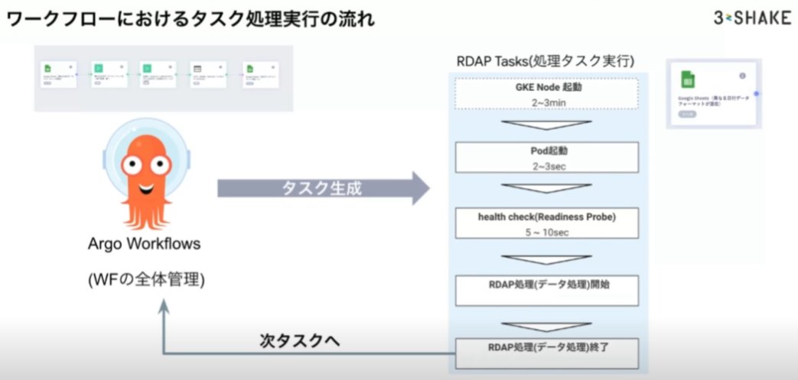
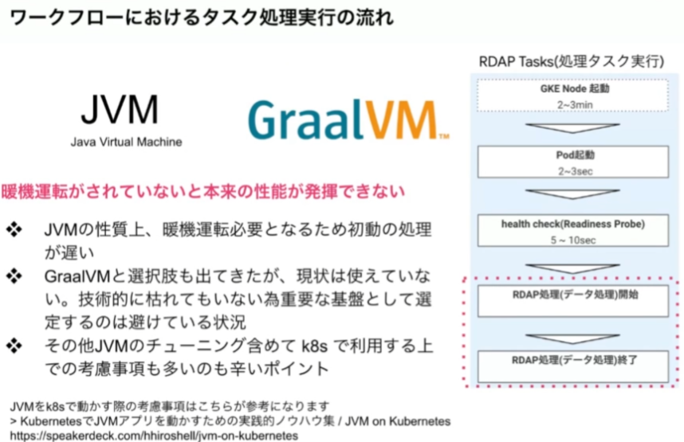
KubernetesでJVMアプリを動かすための実践的ノウハウ集 / JVM on Kubernetes [https://speakerdeck.com/hhiroshell/jvm-on-kubernetes](https://speakerdeck.com/hhiroshell/jvm-on-kubernetes)

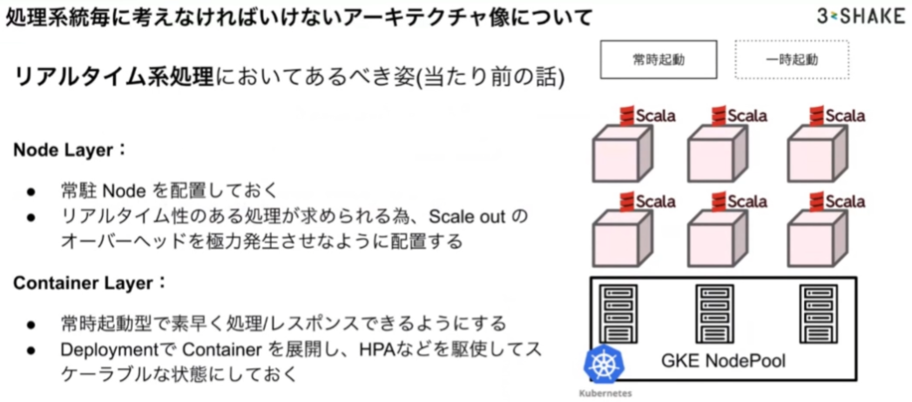

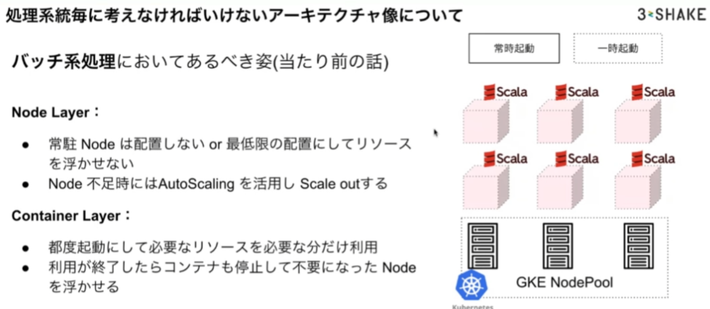

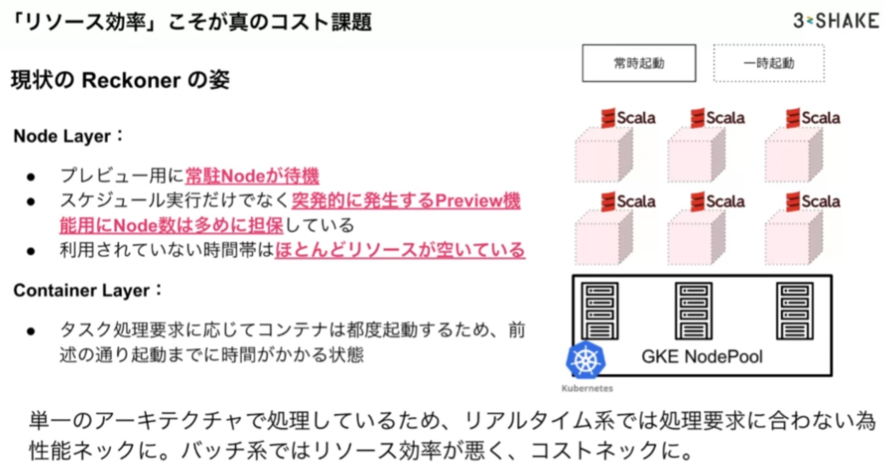
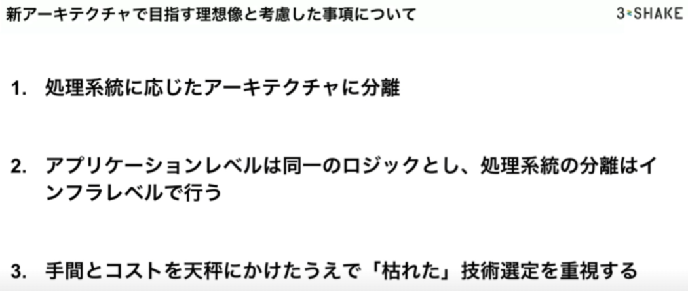

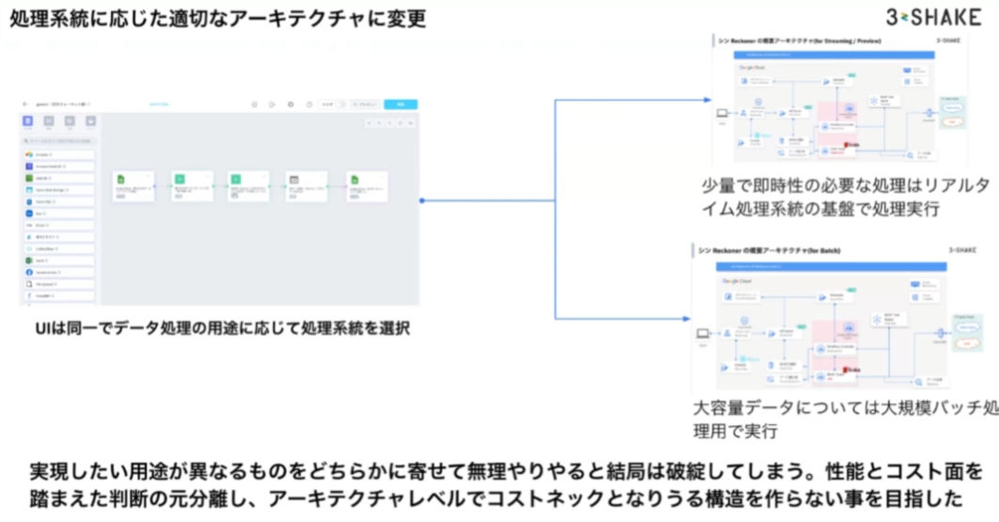

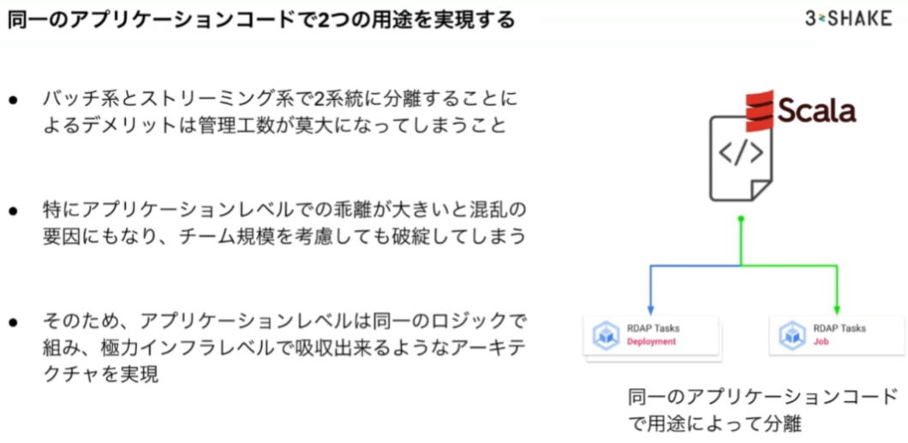

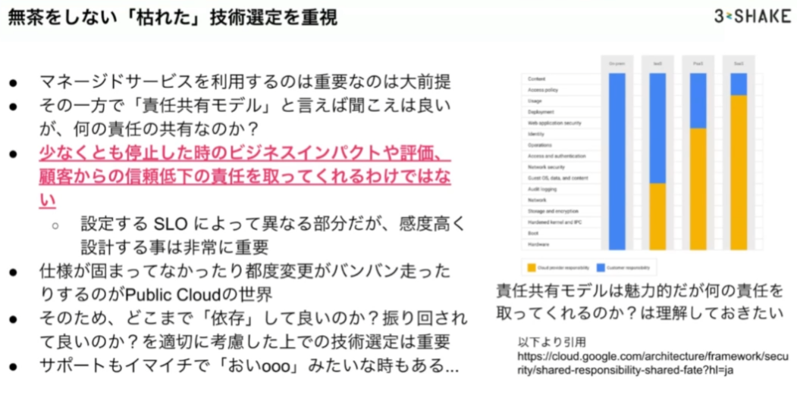

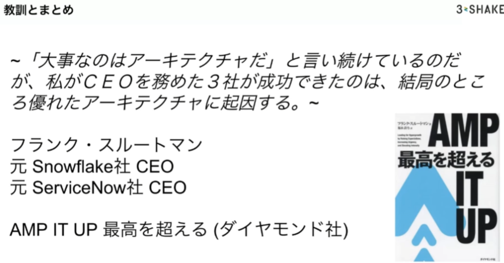

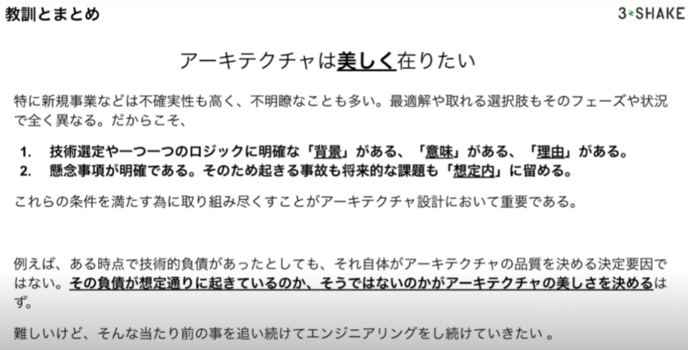

