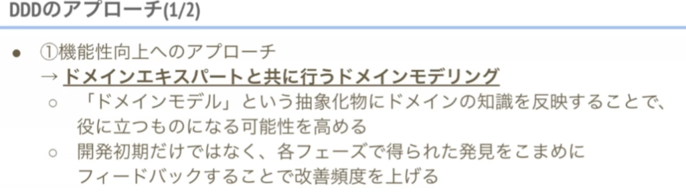
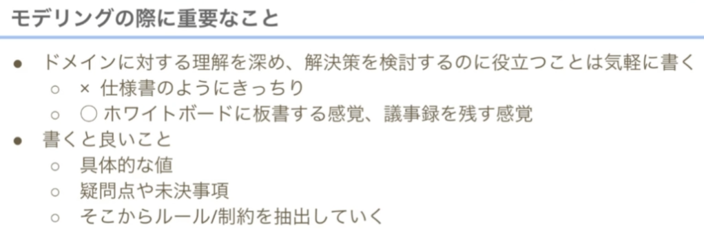
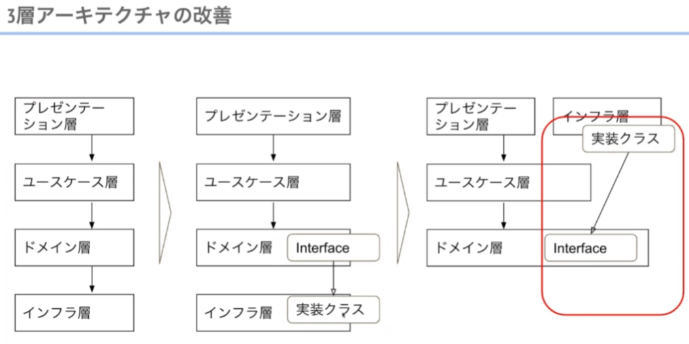

松岡さん

モデリング→アーキテクチャ

何らかの問題を解決するためにソフトウェアを作る

利益

全体のアーキテクチャを整えないとやりづらい

DDDは手段。知識持っている人に聞きに行く

簡単な図であっても、大事な意思決定がされた結果

ユーケースは細かく考える必要があったら書く

ドメインモデル図＝ entity、value object

抽象化したドメインモデル

※具体を示したオブジェクト図の方が分かりやすい（知識の伝達に寄与する）

検討したことを残すことも重要

ドメインモデルは、業務理解と実装の間のもの

## モデルと実装のつながり

実装で気付いたことをモデリングに反映することが大事
→ モデルと

## DDDとアーキテクチャ

実は必然

ビジネスロジックを細かくしよう

アプリケーション層 だと責務が分かりづらい。 ユースケース

DI 

## DDD の実装パターンの参考情報

参考資料： [https://little-hand-s.notion.site/Online-Conference-f545338e5b4d4855a78b28adc1395ffb](https://little-hand-s.notion.site/Online-Conference-f545338e5b4d4855a78b28adc1395ffb)

