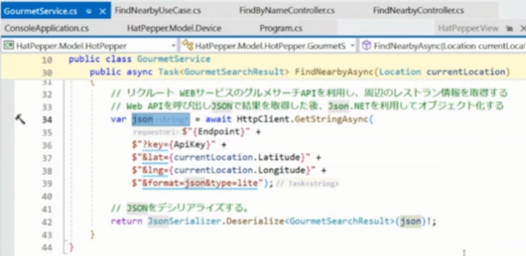

## DIって分かりにくくない？なぜなのか？

hotPepper に変更が入ると

　↓

これにより関心の分離
ただ、どこに置くべき？ 
↓ その際の考え方

変更

問題点とあるべき姿

これをシンプルに実現できる手段が DI

(手動) DI

DI ≠ DI Container

DIは難しい→なぜならパラダイムシフトだから→慣れる→DIの設計はシンプル

## サービスロケーターパターン

DIはサービスロケーターパターンのデメリットを解消している

目的：疎結合

ベストではないが、これ以上ベターなものもない
